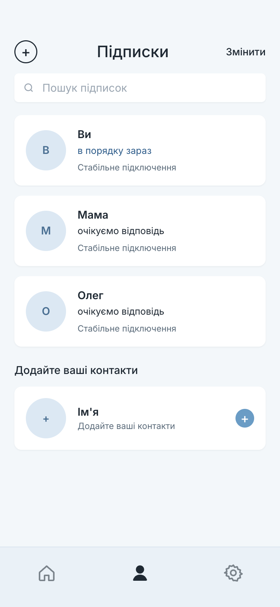
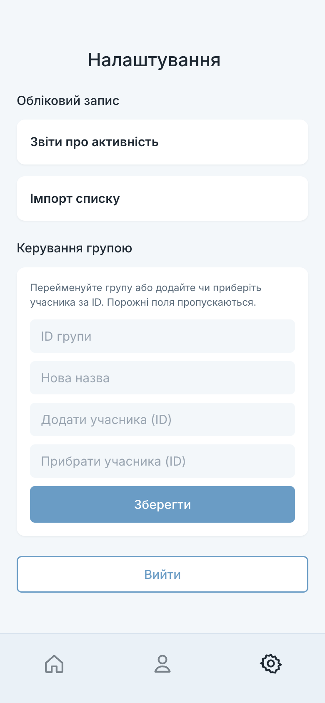

# ty_yak_fe

Client for [ty_yak_be](https://github.com/konstde00/ty_yak_be), the emergency check-in service.
One person asks the people who matter to them whether they are safe, and each of them answers.
"Ти як?" is Ukrainian for "how are you". The interface follows the product's Figma file and is
laid out as a phone application; on a wide screen it renders as a single centred column.

| Home | Compose | Following |
|---|---|---|
|  |  |  |

## What it does

**Home.** "Ти як?" with three answers presented as a carousel: Все добре! (all good), Я в порядку
(I'm okay), Погано (bad). Swipe or tap between them; tapping the centred one opens the compose
sheet. Each answer maps to `StatusEnum` on the backend (`GREAT`, `OK`, `BAD`).

**Compose.** The chosen answer, an optional message, and Надіслати. Sending records the answer
through `PATCH /api/statuses/v1`, after which the backend tells everyone in the person's circle.
The home screen then shows what was sent and when.

**Following (Підписки).** The person's own current answer, the people they follow with search,
and adding or removing contacts.

**Settings.** Group administration through `PUT /api/groups/v1` (rename, add or remove a
member), the activity report and roster import for coordinators, and sign-out.

**Accounts.** Sign-in and registration by e-mail, and password recovery through a confirmation
code.

| Sign in | Settings |
|---|---|
|  |  |

## How it is organized

| Directory | Responsibility |
|---|---|
| `src/components/Main` | home carousel, compose sheet, the three answer states |
| `src/components/Following` | the circle list, search, add and remove |
| `src/components/Settings` | group administration, coordinator tools, sign-out |
| `src/components/Shell` | the bottom tab bar |
| `src/components/Login`, `Registration`, `RestorePassword` | account screens |
| `src/components/Charts`, `Files` | activity report and roster import |
| `src/api` | requests to the backend (`status.js`, `groups.js`, `files.js`) |
| `src/translations` | i18next resources, Ukrainian by default |
| `src/index.css` | design tokens and base styles taken from the Figma file |

React 18, React Router 6, react-i18next, Recharts, react-hook-form, Create React App.

## Running

```bash
npm install --legacy-peer-deps
npm start                       # http://localhost:3000
```

The client expects the backend at `http://localhost:8080`; see
[ty_yak_be](https://github.com/konstde00/ty_yak_be) for how to start it.

## License

Apache-2.0. See [LICENSE](LICENSE).
