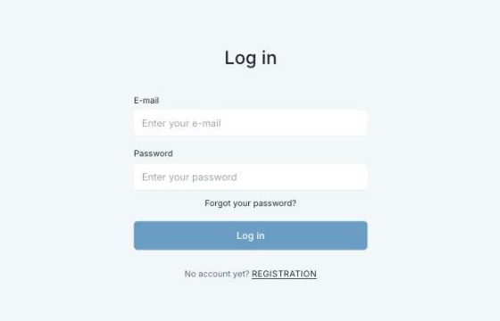

# ty_yak_fe

Administration panel for [ty_yak_be](https://github.com/konstde00/ty_yak_be), the emergency
check-in service: one person asks the people who matter to them whether they are safe, and each
of them answers. "Ти як?" is Ukrainian for "how are you".



## What it does

Sign-in and registration by e-mail, password recovery through a confirmation code, an activity
chart of the most active subscribers, export of that report as a Word or Excel file, and bulk
enrolment of a roster from a Word or Excel file.

## How it is organized

| Directory | Responsibility |
|---|---|
| `src/components` | screens: `Login`, `Registration`, `RestorePassword`, `Home`, `Charts`, `Files`, and the shared `NavBar` |
| `src/routes` | route table and the `PrivateRoute` guard |
| `src/api` | requests to the backend and shared error handling |
| `src/store` | MobX State Tree store for the signed-in user |
| `src/translations` | i18next resources |
| `src/index.css` | design tokens and base styles taken from the Figma file |

React 18, React Router 6, MobX State Tree, Recharts, react-hook-form, Create React App.

## Running

```bash
npm install --legacy-peer-deps
npm start                       # http://localhost:3000
```

The panel expects the backend at `http://localhost:8080`; see
[ty_yak_be](https://github.com/konstde00/ty_yak_be) for how to start it.

## License

Apache-2.0. See [LICENSE](LICENSE).
